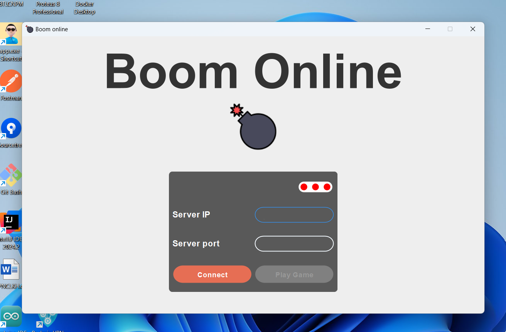
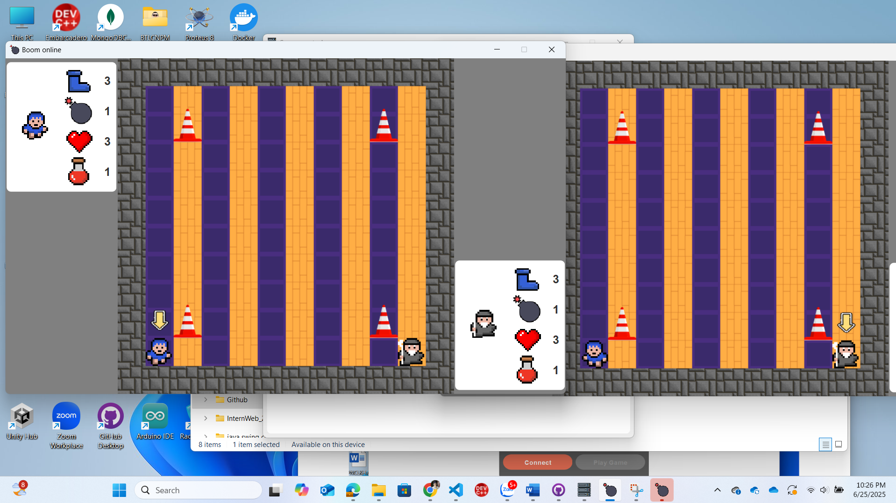
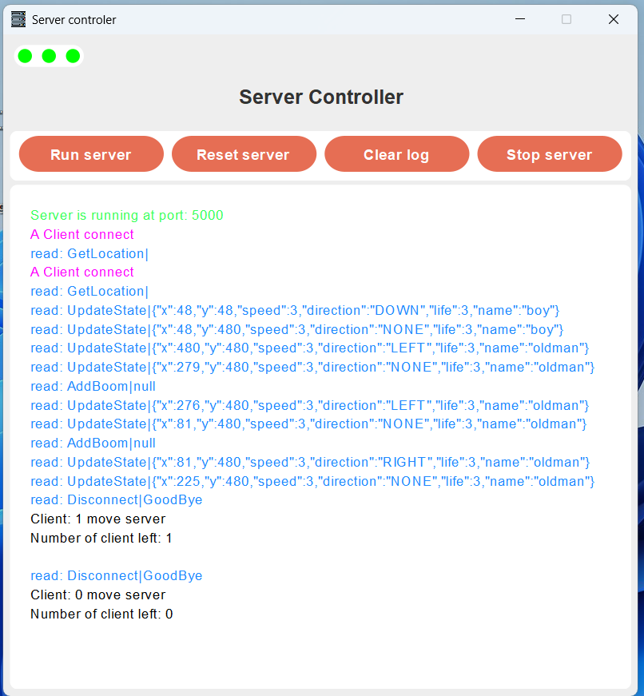

# 2D Game boom online
Hi! My name is Bui Tuan Dung. This project is about using Java Swing and Java Socket to create a 2D game boom.
2 clients can play together using a server.
Both client and server is developed using Java.
This project is 100% using Java core.
# Client
Client is developed using Java Swing for the GUI and Java Socket to communicate with server.
You can see client code here [client code](./client_maven_update)

# Server
Server is developed using Java Socket and Thread library.
You can see server code here [server code](./server_maven_update)

